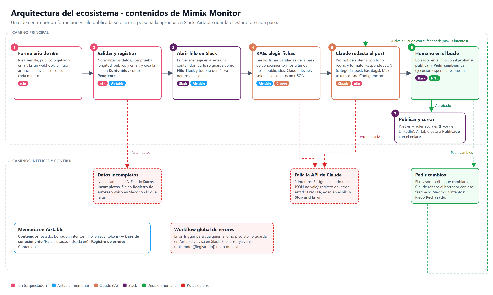

# Ecosistema de automatización IA · Contenidos de Mimix Monitor

Entrega final de **AI Automation (diplomatura)** en Coderhouse.
Burai Vasy Adrian · Comisión #102325

Un flujo de n8n que convierte una idea suelta en un post para LinkedIn. Registra la idea en Airtable, busca en una base de conocimiento validada (RAG), Claude redacta el borrador y **no se publica nada hasta que una persona lo aprueba en Slack**.

## Qué hay en el repositorio

| Qué | Dónde |
|---|---|
| Documento de la entrega (PDF) | [Entrega-final-Burai-Vasy-Adrian.pdf](Entrega-final-Burai-Vasy-Adrian.pdf) |
| Los dos workflows de n8n (JSON) | [flujos/](flujos/) |
| Prompts de sistema de Claude | [prompts/](prompts/) |
| Base de Airtable en solo lectura | https://airtable.com/appFP7Jg4AN5JHQQj/shrJrfLZnyURCnYCJ |
| Vídeo de la demo (2:53) | [video/demo-ecosistema-ia.mp4](video/demo-ecosistema-ia.mp4) |
| Capturas (n8n, Slack, Airtable, formulario) | [capturas/](capturas/) |

## Cómo funciona

1. **Disparador**: formulario de n8n (webhook) con la idea, el público objetivo y el email de quien la pide.
2. **Validación**: si la idea es demasiado corta, falta el público o el email no es válido, no se llama a la IA. El registro queda en «Datos incompletos», el error se guarda en Airtable y se avisa en Slack.
3. **Registro**: la idea entra en Airtable como «Pendiente» y se abre un hilo en Slack. El `ts` de ese mensaje (Thread ID) se guarda y todo lo demás de esa idea va dentro del hilo.
4. **RAG**: se leen las fichas validadas de la base de conocimiento y los últimos posts publicados. Claude elige qué fichas hacen falta y responde solo con sus ids en JSON.
5. **Redacción**: Claude escribe el post con esas fichas y responde en JSON (`categoria`, `post`, `hashtags`). El máximo de tokens sale del nodo Configuración.
6. **Humano en el bucle**: el borrador llega al hilo con dos botones, «Aprobar y publicar» y «Pedir cambios». Si se piden cambios, Claude lo rehace con el comentario del revisor (máximo 3 intentos; luego queda «Rechazado»).
7. **Publicación**: al aprobarlo se publica en el canal #redes sociales (hace de LinkedIn) y Airtable pasa a «Publicado» con el enlace.

Si falla la API de Claude, el nodo reintenta y, si sigue fallando, el flujo guarda el error en «Registro de errores», pone la idea en «Error IA», avisa en el hilo y termina con Stop and Error. Un segundo workflow (Error Workflow) recoge cualquier otro fallo sin duplicar los que ya están registrados.

## Pruebas

| # | Ejecución | Caso | Resultado |
|---|---|---|---|
| 1 | 11 | Camino feliz | Publicado |
| 2 | 12 | El revisor pide cambios | Segundo borrador aprobado y publicado |
| 3 | 13 | Idea demasiado corta y sin público | Datos incompletos, sin llamar a la IA |
| 4 | 14 | Claude caído | Error registrado, aviso en el hilo, Stop and Error |
| 5 | 15 | Workflow global de errores | No duplica el error de la prueba 4 |
| 6 | 16 | Tres rechazos seguidos | Rechazado al tercer intento |
| 7 | 17 | Sin email | Datos incompletos |
| 8 | 18 | Prueba 7 reenviada con email | Publicado |
| 9 | 20 | Prueba 4 reenviada con Claude funcionando (vídeo) | Publicado |

El detalle de cada una, con capturas, está en el PDF.

## Cómo importarlo en n8n

1. Workflows → Import from File, con los dos archivos de `flujos/`.
2. Crear las credenciales de Airtable (token personal), Slack (token del bot) y Anthropic, y asignarlas a sus nodos.
3. En el flujo principal: Settings → Error Workflow → «Registro global de errores».
4. Revisar el nodo **Configuración** (canales de Slack, modelo, tokens máximos, intentos) y la base y tablas de los nodos de Airtable.

## Notas

- n8n 2.40 autoalojado en mi PC. Los botones de aprobación de Slack apuntan a las URL de espera de n8n (localhost), así que funcionan desde el equipo donde corre n8n. En un servidor con dominio (variable `WEBHOOK_URL`) funcionarían desde cualquier sitio.
- La credencial de Anthropic apunta a un pequeño conector local que usa mi suscripción de Claude, para no pagar créditos de API durante el curso. El nodo es el oficial de Anthropic: con una API key normal funciona igual cambiando la URL base de la credencial.
- LinkedIn está simulado con un canal de Slack.
- En el vídeo no aparece ninguna clave ni credencial.
